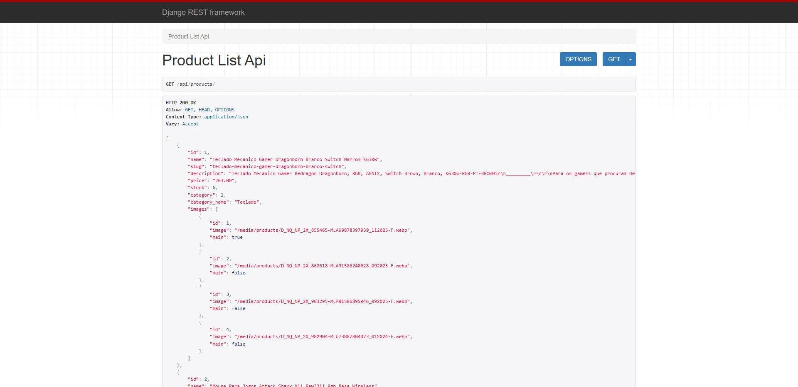
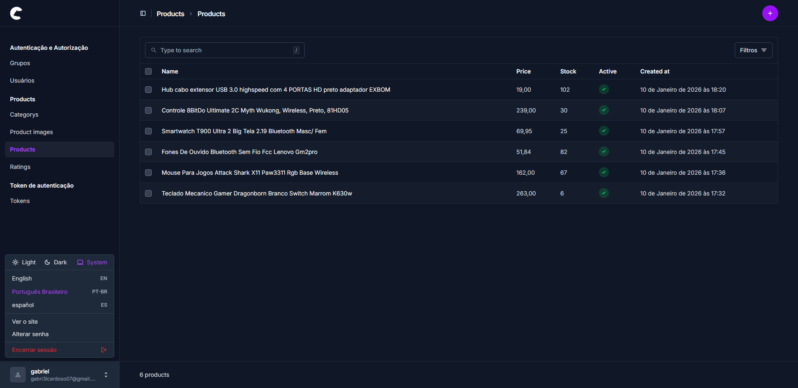

<div align="center">
  
</div>

---

<h1 align="center"> IPolar - E-commerce Django</h1>

> [!NOTE]
> <h3>🏗️ STATUS: em construção 🚧</h3>
---

<h2 align="center">📖 Sobre</h2>

<p align="left">
O <strong>E-commerce Django</strong> é uma aplicação web de e-commerce desenvolvida com <strong>Python e Django</strong>, combinando páginas renderizadas no servidor com uma <strong>API REST</strong> para operações centrais do sistema. O projeto implementa autenticação de usuários, gerenciamento de produtos e lógica de carrinho de compras, com endpoints preparados para consumo interno ou por aplicações externas. O backend é estruturado de forma modular, com persistência em banco de dados relacional e organização voltada para escalabilidade e integrações futuras, como pagamentos ou frontend desacoplado.
</p>

---

<h2 align="center">✔ O projeto contém:</h2>

✅ Autenticação de usuários<br>
✅ API REST para operações principais<br>
✅ Gerenciamento de produtos<br>
✅ Carrinho de compras<br>
✅ Páginas renderizadas no servidor<br>
✅ Painel administrativo<br>
✅ Backend modular<br>
✅ Integração com banco de dados relacional<br>

---

<h2 align="center" >🚀 Instalando</h2>

## Clone o repositório
```
git clone https://github.com/gabriell-c/ecommerce.git
```

## Acesse o diretório do projeto

```
python -m venv venv
venv\Scripts\activate
```

### Linux / macOS
```
python3 -m venv venv
source venv/bin/activate
```

## Instale as dependências
```
pip install -r requirements.txt
```

## Aplique as migrations do banco de dados

```
python manage.py migrate
```

## Crie um usuário administrador

```
python manage.py createsuperuser
```

## Inicie o servidor

```
python manage.py runserver
```

Acesse o painel administrativo http://127.0.0.1:8000/admin

<h2 align="center">💻Preview</h2>

</img>
<br>
<br>
</img>
<br>
<br>


---

<h2 align="center">🛠 Tecnologias usadas</h2>
<div align="center" >
  
  
  
  
  
  
</div>

---

<h2 align="center">📝Licença</h2>

<p align="center">
   Este repositório está sob licença MIT. Você pode ver o arquivo <a href="https://github.com/gabriell-c/ecommerce/blob/main/LICENSE"> LICENSE</a>
   para mais detalhes. 😉
</p>
